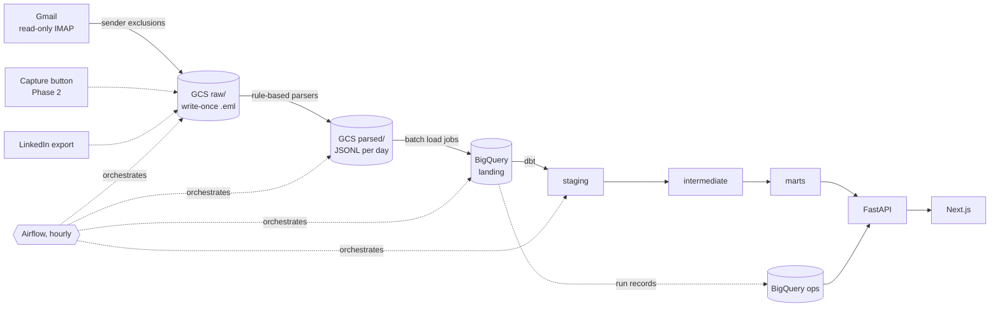

# TraceMail

[](https://github.com/ErenReyhanlioglu/tracemail/actions/workflows/ci.yml)


**An hourly data pipeline that turns a job-search mailbox into a tracked,
measured, and explainable record of every application.**

TraceMail reads a job-application mailbox (read-only), stores every relevant
mail unchanged in a data lake, parses it with versioned rule-based parsers,
loads it into a layered BigQuery warehouse, and models applications, postings,
and replies with dbt. Later phases add an LLM matching report with verifiable
evidence, a hand-labeled evaluation gate in CI, and a public health panel where
the system reports on itself.

It runs on real data only. There is no demo dataset: the public panel shows
real system metrics or nothing.

## Why this project

It is built as a working system, not a tutorial: real mail, real cloud
accounts, real costs, and real failure modes. Every significant choice is
recorded as an [Architecture Decision Record](docs/adr/README.md) with the
alternatives that were rejected and the sources it relied on, and every
pipeline step measures its own time, volume, operations, and cost
([ADR-0017](docs/adr/0017-every-step-measures-time-volume-operations-and-cost.md)).

## Architecture



| Layer | Role | Key property |
|---|---|---|
| `raw/` (GCS) | Original mail bytes | Write-once, deterministic keys: a rerun is a no-op |
| `parsed/` (GCS) | What the parser understood, as JSONL | Rewritten per day; every row carries parser name and version |
| `landing` (BigQuery) | Parser output as tables | Schema generated from Pydantic models; each load replaces one day's partition |
| `staging` / `intermediate` / `marts` | dbt models | Deduplication across sources, star schema, data tests |
| `ops` (BigQuery) | Run records and quality metrics | Feeds the public health panel |

The whole analytic layer can be rebuilt from `raw/` after a parser change.

## Engineering highlights

- **Idempotent by construction.** Ingestion works on date windows with no
  stored watermark, raw writes use a create-only precondition, and loads
  replace exactly one date partition. Loading the same eight days three times
  produced identical tables, verified with order-independent content
  fingerprints.
- **Privacy at the door.** Personal-account and newsletter senders on an
  exclusion list are never stored and never logged beyond a count. The mailbox is opened read-only and fetched with
  `BODY.PEEK`, so nothing is ever marked as read; a test enforces both. Run
  error messages are scrubbed of addresses and quoted values before they are
  written.
- **Parsing failures are data.** Every message yields exactly one parse
  outcome (parsed, failed, or unclaimed with a reason), so parse quality is a
  metric, not a log line. Templates are detected by a language-independent
  marker, and unrecognized lines are kept rather than dropped.
- **Measured, not assumed.** Each step returns a result model with durations,
  record counts, bytes, and per-service operation counts, written to
  `ops.pipeline_runs` in a shape aligned with data observability pillars and
  OpenLineage
  ([ADR-0020](docs/adr/0020-run-records-follow-observability-frameworks.md)).
  Optimizations are reported with before and after numbers.
- **Cost-aware on free tiers.** Batch load jobs instead of streaming inserts,
  `maximum_bytes_billed` on every query, no BigQuery Storage Read API, and an
  open analysis of GCS operation counts under hourly runs
  ([ADR-0021](docs/adr/0021-gcs-operations-under-hourly-runs.md)).
- **Secure deployment design.** The production VM has no open inbound port:
  public traffic arrives through Cloudflare Tunnel, deploys and SSH go over
  Tailscale, and GitHub Actions reaches GCP through Workload Identity
  Federation with no stored keys.

## Measured so far

From the dev environment, on real mail (October 2026):

| What | Result |
|---|---|
| Parse outcomes over 9 days | 72 messages: 70 parsed, 0 failed, 2 unclaimed |
| Ingesting a 7-day window (114 messages) | 55.3 s → 5.9 s; IMAP commands 115 → 3 after batching |
| Loading 24 partitions into BigQuery | 78.5 s → 15.5 s with concurrent load jobs |
| Repeated loads of the same range | Identical row counts and content fingerprints, 3 of 3 runs |

Details and caveats are in the ADRs that report them
([0017](docs/adr/0017-every-step-measures-time-volume-operations-and-cost.md),
[0019](docs/adr/0019-landing-load-schema-from-models-and-partition-replace.md)).

## Status

| Phase | Scope | State |
|---|---|---|
| 1. Core | Ingestion, parsing, warehouse, dbt models, Airflow, CI/CD, owner login, application list | In progress ([roadmap](docs/roadmap.md)) |
| 2. Intelligence | Reply classification, evidence-quoted match reports, golden set, MLflow comparison, CI eval gate | Planned |
| 3. Interface | Public health panel, share links, full private sections | Planned |
| 4. Optional | Rough fit ranking with a local embedding model, follow-up drafts | Planned |

Phase 1 has no LLM by design: the data foundation comes first.

## Tech stack

| Area | Tools |
|---|---|
| Languages | Python 3.12, SQL, TypeScript |
| Ingestion and storage | IMAP, Google Cloud Storage |
| Warehouse and modeling | BigQuery, dbt |
| Orchestration | Apache Airflow 3.3 (LocalExecutor), Astronomer Cosmos |
| Serving | FastAPI, Next.js |
| LLM (Phase 2) | Gemini via Google Cloud, Pydantic structured output, MLflow |
| Infrastructure | Docker Compose, Oracle Cloud ARM VM, Cloudflare Tunnel, Tailscale |
| Quality | pytest (90% coverage floor), dbt tests, ruff, mypy `--strict` |
| CI/CD | GitHub Actions with SHA-pinned actions, GHCR, Workload Identity Federation |

## Repository layout

```
packages/pipeline/   IMAP fetch, sender exclusions, raw writes, parsers, loads
packages/llm/        Phase 2: provider interface, prompts, call logging, budget
packages/evals/      Phase 2: golden set, evaluation runner
apps/airflow/        DAGs (wiring only) and image
apps/api/            FastAPI service
apps/web/            Next.js app
dbt/                 dbt project with its own environment
infra/               Docker Compose and VM setup
docs/                ADRs and roadmap
```

## Development

Requires [uv](https://docs.astral.sh/uv/) and [just](https://just.systems/).

```sh
uv sync          # create the environment from uv.lock
just check       # lint, typecheck, and test
just --list      # every available command
```

Running the pipeline needs a GCP project, a mailbox app password, and a sender
exclusion list; see [.env.example](.env.example) for the settings it reads.

## Documentation

- [SUMMARY.md](SUMMARY.md): product scope, phases, out-of-scope list, known
  limits, and the competencies the project is built to demonstrate
- [docs/adr/](docs/adr/README.md): every architecture decision with its
  alternatives and sources
- [docs/roadmap.md](docs/roadmap.md): build order and current step
